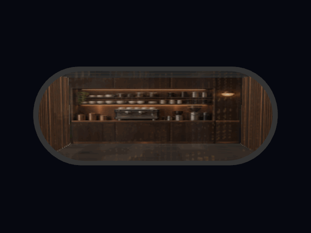

# Window Shopper

RealityKit parallax interiors, ready for display.



Window Shopper renders a convincing room behind a single architectural window
surface. A RealityKit Shader Graph projects the room shell, up to four transparent
foreground layers, optional solid calibration furniture, emissive artwork and a
world-oriented glass reflection. The result responds to the viewer's position in
stereo without constructing a full room from separate entities.

The package includes:

- `WindowShopper`, a reusable Swift library for macOS 26 and visionOS 26.
- `WindowShopperDemo`, a SwiftUI editor and RealityKit preview app.
- 28 starter presets covering apartments, cafés, workspaces, connected rooms and
  several aperture shapes.
- Full, reduced and baked quality levels, portable preset documents and tests that
  render the shaders through RealityKit.

## Run the demo

Open `Package.swift` in Xcode, select the `WindowShopperDemo` scheme and run it on
My Mac. Enable **Sweep** to orbit the camera automatically. Select the visionOS
run destination to inspect the same window at physical scale in a mixed immersive
space; move your head rather than rotating the window to assess the stereo effect.

From Terminal:

```sh
swift run WindowShopperDemo
```

## Add it to a visionOS project

In Xcode, choose **File › Add Package Dependencies…**, enter the repository URL,
and add the `WindowShopper` library product to your visionOS app target. During
local development you can instead drag this package's folder into the project.

Create and retain one `WindowResources` instance for a scene or editing session;
it caches meshes, textures and shader templates. Register `WindowComponent` once,
load a preset, then add the generated entity to a `RealityView`:

```swift
import SwiftUI
import RealityKit
import WindowShopper

struct ParallaxWindowView: View {
    @State private var resources = WindowResources()

    var body: some View {
        RealityView { content in
            WindowComponent.registerComponent()

            let library = try WindowLibrary.starter()
            guard let preset = library.presets.first(where: { $0.id == "night_cafe" }) else {
                return
            }

            let window = try await resources.makeWindow(
                component: WindowComponent(
                    id: "CafeWindow",
                    presetID: preset.id,
                    quality: .full
                ),
                library: library,
                root: WindowLibrary.starterResourceRoot
            )

            // Presets face +Z. Place the pane in metres like any RealityKit entity.
            window.position = [0, 1.4, -3]
            window.orientation = simd_quatf(angle: .pi, axis: [0, 1, 0])
            content.add(window)
        }
    }
}
```

Use `.full` near the viewer, `.reduced` when one foreground silhouette is enough,
and `.baked` only when the preset supplies `bakedAppearance` or contains no layered
content. `WindowPreset` dimensions are metres, +Y is up, its front normal is +Z,
and positive layer depth recedes into the room along −Z.

For a custom window, copy a starter `WindowPreset`, replace its relative texture
names with files in your own resource directory, validate it, and pass that
directory as `root`. `WindowShopperDemo` can edit the dimensions, aperture,
layers, glass and lighting, then save a portable JSON document containing the
referenced images.

## Validate changes

```sh
swift test
swift run WindowShopperDemo --self-test
```

Generate the README animation from the real RealityKit renderer:

```sh
swift run WindowShopperDemo --capture-gif Media/window-shopper-demo.gif
```

## License and contributions

Window Shopper is available under the [MIT License](LICENSE). Issues and pull
requests are welcome; see [CONTRIBUTING.md](CONTRIBUTING.md).
